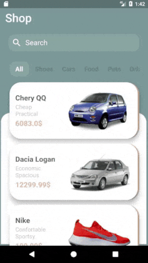
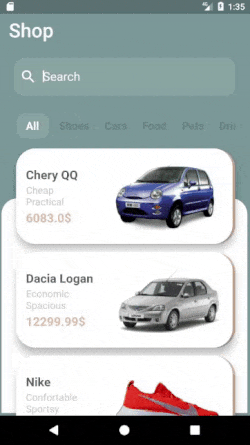
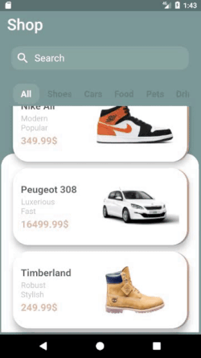

# flutter_shopping_app

## Description:
This is my first "big" project (sort of speaking) using flutter, i plan to add a few tweeks to it but so far i'm satisfied with the flutter project structure and the general usage of the UI tree. 

## Tools & languages: 
* Android Studio (IDE).
* Dart (Logic & Design).
* Flutter (Mobile UI developement kit).
* Paint.Net (Image editting).

## Screenshots: 
   

## Features:
* Tabs for differents products categories.
* Search functions that works through changing tabs.
* Animating transitions between landing page and product detail page.

## TODO:
* [ ] Hook the app with a shopping API.
* [ ] Adding accounts for shoppers.
* [ ] Exploring E-Payement in Flutter.
* [ ] Adding rating and charts.

## Contribution:
Feel free to `fork` this project and add whatever you like. If you have any suggestions or any comments please feel free to contact me or to open an issue, use free license art assets please.

## Special Thanks:
 #### This design was directly inspired by [Sina Amiri](https://dribbble.com/sinaamiri).
 #### The hero animation was a tip from [AlaaEdAouimeur](https://github.com/AlaaEdAouimeur).

## Team:
[Jetlighters](https://github.com/JetLightStudio) having fun.
